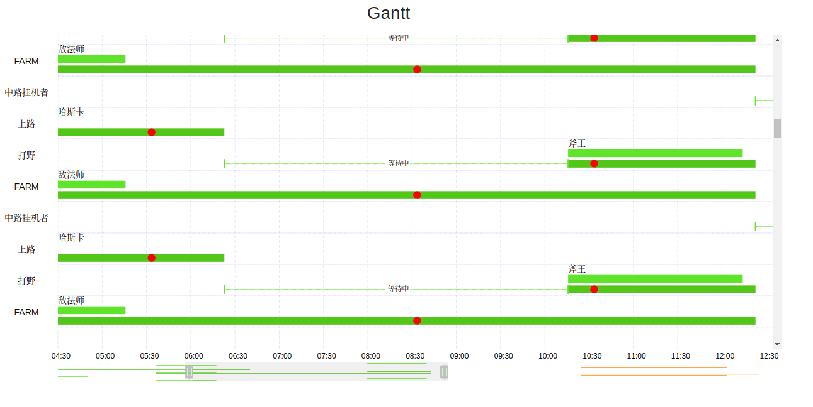

# 展示



# 使用

    yarn & yarn start

# 如何画一个 gantt 图

1. 什么是 gantt 图 ?

甘特图（Gantt chart）又称为横道图、条状图(Bar chart)。其通过条状图来显示项目，进度，和其他时间相关的系统进展的内在关系随着时间进展的情况。以提出者亨利·L·甘特（Henrry L. Ganntt）先生的名字命名(https://baike.baidu.com/item/%E7%94%98%E7%89%B9%E5%9B%BE)

2. 目的
    绘制一副反应每日任务(24HR)
3. 组成

                  Title
    
        任务名 
          Y         图表    X 轴
          轴     
                概要图 | 漫游器

4. 哪些功能?
    1.  图表绘制
    2.  漫游器 控制左右和 缩放比例
    3.  节点事件 (hover  | click)
    4.  标识节点中特殊事件 
5. 如何实现

    1.  Title
        正常的 DOM 节点,固定的高度
    2.  Y 轴
        展现任务名
        1. 特殊点:
            1. 固定位置, 不会随图表的左右滑动而改变自己的位置
                和 X 轴属于同一个 SVG , <YAxis />
            2. 宽度对结构的影响不会很大, 但高度:
                - 文字始终在中间位置 (计算得出),
                - ~~~右边的图表的高度可能会变化, 但Y轴上的高度是最高一层的高度~~~
                - 在绘制时, 每一层的高度都已经固定了. 这是因为图表的每一行都是有 `deltaY` 来确定的
        2.  如何绘制:
            传入的 props: {
                names: []string,
                h: number // 一行的高度
                width: number //宽度
            }
            所以, 绘制的宽度和高度都是在绘制之前就已经确定,若某个 name 太长, 会延伸到 XAxis 中.
            ```javascript
            const names = ["任务1", "任务2", "任务3"];
            const h = 35;
            const startX = 3,startY = 3;
                const YAxis = ({ names, h, width }) => {
                return (
                    <g id="yaxis">
                    {names.map((name, i) => {
                        return (
                        <React.Fragment key={name}>
                            <rect x={startX} y={startY + h * i} width={width} height={h} />
                            <text x={23} y={25 + h * i}>
                            {name}
                            </text>
                        </React.Fragment>
                        );
                    })}
                    </g>
                );
                };
            ```
    3.  X 轴 (时间轴)
        > 发散思维, 提取共同点 (见: 编码实现)
        1.  时间轴,  将 24 小时展现为 48列 小rect & 任务数列
            <rect x="" y="" width={rectWidth} height={rectHeight} />
        2.  ~~~每半个小时区间内~~~ 任务起止点精确到秒    
            >   画布整体是 某一天的 [00:00 - 24:00], 宽是固定的(700), 可以通过计算得出 `rect`的 x 和 y, 不同的是缩放比例
            1.  绘制辅助线
            3.  绘制预期时间段 averageValue
            4.  绘制实际花费时间段 { startTime, endTime}
            5.  绘制特殊事件 // []highlightPoints
            6.  绘制等待时间段 // 与前一个任务相距的时间段
            7.  绘制name
        3.  缩放 & 漫游
            - 效果: 起始比例是 1 , 展现完整的宽度 [0, 700]
                - 漫游到某一点, 例如 [200, 700], 那么
                    1.  x 轴的变化:
                        -   辅助线  [0, 200] transition( { 200 - 当前 x 位置  } , 0)
                        -   辅助线  [200, 700] transition ( { 200 - 当前 x 位置 } , 0)  
                    2.  w 的变化:
                        -   除了name 外, 其他各个 rect 都是需要改变自己的 width
                        -   这个计算的模式应该是相同的 [ 给定的 startTime, averageValue 等条件 ], 提取到一个 HOC 中
                        -   原本是 1 的比例, 现在要变成 500 / 700 : k / 1
                -   测试可行性 : 
                    1. 使用 symbol 调整 viewport 的方式
                        1.  symbol 包裹 一些 svg 图形, 定义 viewBox `[x , y, w , h]`, 设置每个模板的可见部分应该是什么. 预想是改变 width 的值
                        2.  但不可行的一点是, symbol 中图形在 会根据use 中的`width | height`来 **缩放** 整个图形从而确保内部的图形是置中的,显而易见的是这些改变会影响图形的高度
                        3.  如果要调整比例, 那么 use 和 symbol的值都需要改变, 所以这个方案是**不可行**的. 
                    2.  直接按比例调整 每个元素的 width 的值
                        ~~~已测试, 调整比例和 xLeft都可行. 代码可检查 `tests.js`~~~
                        在改变比例时, x 的起点位置同样要变化
                        如何变化:
                          ~~~1.  根据 比例 计算得出 `rect` 将会改变的 deltaWidth 
                                  = initialWidth / proption - initialWidth 
                          2.  这个值 / proption 就是 两者之间的距离~~~
                          deltaX = initialX / proption
        4.  响应事件
            > Svg 是dom 元素, 相比较 canvas , 在事件处理上有优势. (https://www.w3.org/TR/SVG11/interact.html)
            
            1.  hover 事件 , onMouseEnter, onMouseLeave
            2.  click 事件 , onClick
    4.  漫游器
        > 是一个渲染了微小化的 X轴上元素的, 左右 extend 和 drag两个功能 的 Component
        同一个 svg 下, 确保位置计算时
        1.  渲染和 [3] 一样, 但是initial一次, 后期的 state change 不影响
        2.  对外接受一个 onChange 回调 prop
        3 .  测试:
            ~~~使用 `symbol` 包裹 [3] 的组件, 可以使用该方式渲染一个微小化的 x轴,~~~
            使用 `symbol` , 会根据 width | height 的大小, 缩放整个 `use` 的 svg图形, 使其在 `width & height` 的中心位置.
            但是没有办法去限定 height 的时候修改 width 的长度, 这两个总是会取其一来计算位置. 
            ```javascript
              const HalfHour = props => {
                return (
                  <React.Fragment>
                    <defs>
                      <symbol id="render" viewBox="0 0 750 550">
                        <ChangeRect {...props} />
                        <ChangeRect {...props} index={2} />
                        <Dot {...props} />
                      </symbol>
                    </defs>
                    <use href="#render" x="0" y="00" width="750" height="550" />
                  </React.Fragment>
                );
              };
            ```
            

             遇到的问题是 当在其他位置 `use` 这个 symbol 的时候, 它的改变是同步的. 而这是我不想要的
             
             找到一个方式可以阻止其更新状态
             ```javascript
              export const ID = "@@Gantt";
              export const ID_READONLY = ID + "-ReadOnly";
              class Inner extends React.Component {
                shouldComponentUpdate(...args) {
                  const { readOnly } = this.props;
                  return !readOnly;
                }
                render() {
                  const props = this.props;
                  const id = props.readOnly ? ID + "-ReadOnly" : ID;
                  return (
                    <symbol id={id} viewBox="0 0 750 550">
                      <ChangeRect {...props} />
                      <ChangeRect {...props} index={1} />
                      <Dot {...props} />
                    </symbol>
                  );
                }
              }
              ```
              ~~~渲染两个 X 轴到 refs 中,在使用的时候通过 `use` 的 `width` 和 `height` 控制视口的大小~~~
              
              根据 `readOnly` 属性值 在 calc 时 改变 `SVG` 图形的 高度 从而改变整个 svg 的高度

# 编码阶段
1. 如何使用 
    ```javascript
    <Gantt 
      {...props}
    />
    ```
2.  思考可能的需求
    > 在实现之前, 尽可能多的思考会有的需求, 努力去避免后期沦入 `添加功能 -> 引起BUG -> 修复BUG `的境地.
     但同时要小心不要将**额外**的功能点考虑进来, 确保组件功能的`SOLID`
    
    1.  展示型组件, 不考虑修改 `data`. 而是由事件将数据传出    
    2.  每一个任务在由一个 `g` 包裹, 可以由用户添加自定义的 `props`, 比如 `onClick`, `className`
    3.  任务在某个时间点发生了 特殊事件 , 该 `Point` 可以被点击和 `hover` .  `highlightPoints`中可以为其添加多种 `props`
    4.  如果 等待时间 和 task 都需要一个 `hover` 组件, 这个组件需要是可替换的
    5.  waiting | usedTime | avarageValue, 颜色 | 内容 可自定义
    6.  每行的高度 | YAxis 的宽度 | 整个 组件所占 宽度 | XAxis 的高度
3.  接受的 props 
      1. data required
        ```typescript
        {
          id: string, // ...
          name: string // 展示名, 展示在最高层
          usedTime: {
            startTime: number // 微秒
            endTime : number // 微秒
          },
          YAxis: string // 任务名 
          highlightPoints: {
            time: number // 微秒
            ...specificProps // 可以传递任意的值, 这些都会 patch 到 绘制的 `ellipse` 上面
          }[],
          avarageValue: number | {  } // 微秒, 该任务平均花费的时间,
          hoverComponent: ( type: 组件的类型(Await | USED | AVARAGE) ) => React.ReactComponent // 可以被 React.cloneElement 所覆盖 , default = (props) => <React.Fragment {...props} />,
          avarageColor?: string,
          waitingColor?: string
          usedColor?: string
          lineHeight?: number = 50,
          leftWidth?: number = 100,
          xAxisWidth?: number = 750,
          chartHeight?: number = 1000
          ...restProps // 可以传递任意的值, 这些都会 patch 到 每个单元 `g` 上面
        }[]
        ```
      2. date 
        当天的日期 required
4.  组件设计
      1.  Root 组件, 由 React.createContext 保存传递 props
      2.  首先绘制 YAxis 任务名 和 XAxis 上面的 辅助线 , 这两个是固定的高度, XAxis 接受额外的两个 prop -> proption = 1 和 startX = 0
      3.  绘制辅助线, 会根据 proption 和 startX 变化. 需要绘制 48 列 data[].length 行 个 辅助线
      4.  ```javascript
            data.map((d, i) => {
              // 1. 拿到 usedTime
              需要将 startTime 和 endTime 转化为 x 坐标 和 width
              因此需要计算 
                1. x 轴 原点是 这一天的 起点时间
                2. deltaTime = startTime - initialTime
                3. 总长度是固定的 xAxisWidth, 所以 x / xAxisWidth = deltaTime / fullDayTime 这里的 x = initialX
                4. 同样的方式 拿到 initialWidth
                5. AWait 组件的终点是 initialX, 宽度是 此任务和上一个任务的 时间间隔
                6. 
            })
          ```
      5. 绘制底部刻度
          见 `<Graduation />`
      6. slide 漫游器
          - 遇到的问题:
            1.  drag 状态的保持. 是只在 drag 时, 浏览器才会 有 列如 鼠标保持 drag 图标
            2.  draging 中, 如何得到 坐标数值从而改变 state 
            3.  在计算位置的时候, 通过哪些方法去计算 改变 `slide` 的属性 关系到整个控件在使用时得到的是否合理
                1.  比如 计算`leftX` `width` 时, 这些属性在 `dragging` 时 只根据接受到的 `offset` 去改变 `leftX` 和`width` 这些属性得到的值, 经过计算是会有一些偏差的.
                2.  避免偏差的出现, 需要 `总量` 参与进来. `xAisWidth` 是总量, 而同时 `leftX` 和 `rightX` 在 stretch 的时候 只会有一个被改变, 那么`currentWidth` 就是 `总量 - 某一方的改变值 - 另一方的值`
                
# 优化

1.  管理状态使用的是 `React.createContext`, 在 Component 中 如果重新 `render` , 此时 ~~~不论传给 `Provider` 的 `value` 值是什么, 是否是同一个值~~~ 只要 传递给 `Provider` 的 `value` 值不同, **这里要注意的是 `{...}` es6 中的解构操作, 他会生成一个新的对象**, 它的`Comsumer` 都会重新计算它的 `children()`
2.  dragging handler 花费时间过多, 即使是在 `build` 的环境中 依然会很卡
    - 代码中, 目前的操作会导致的更新, 主要是 `XAxis` 中的 每一个svg 图形的 `style` , 也就是 `transform` 和 `width`.
    - 目的是减少 rerender 的操作, 可通过 `throttle` 或者 [更新 style element](https://github.com/atlassian/react-beautiful-dnd/blob/0fb4dc75ea9b625f64cac48602635ac2822f26ec/src/view/style-marshal/style-marshal.js) 等方式
3.  ~~~当前使用的方式是 `throttle` , 遇到的问题是这个 `间隔值` 并不好设置. 而且在 `data`变化到比较大的时候, 每一次都要 rerender`o(data.length * N)`次, 这会导致 很严重的 性能问题.~~~
    修改为 mousemove handle

4.  造成这种现象的主要的问题是**过度渲染**. 在现在的代码中, 渲染的复杂度是 根据 `HelpRects`的 **`O(n*column^data.length)`**. 
    但实际上, 达到同样的目的 只需要 渲染 `column + data.length` 条线段即可达到目的
5.  在 React 中 渲染同样的数组, 更细粒度的划分组件, 得到的结果性能更优
    在 `HelpRects` 组件中, 如果组件更新时,在 `render` 方法中 都重新生成一组 子组件 和  只更新子组件 相比, 帧数平均要高 `1~2` 帧    
    这是 优化前的代码:
    ```javascript
         return (
            <GanttStateContext.Consumer>
              {({ proption, transform }) => {
                const rows = data.length;
                const originalWidth = xAxisWidth / columns;
                let rects = [];
                for (let r = 0; r < rows; r++) {
                  rects.push(
                    <line
                      key={'row - ' + r}
                      {...lineProps}
                      x1="0"
                      x2={xAxisWidth / proption}
                      y1={r * h}
                      y2={r * h}
                    />
                  );
                }
                for (let c = 0; c < columns; c++) {
                  const x = originalWidth * c / proption;
                  rects.push(
                    <line
                      key={'column - ' + c}
                      {...lineProps}
                      x1={x}
                      x2={x}
                      y1={0}
                      y2={chartHeight}
                    />
                  );
                }
                return <g
                  transform={transform}
                  className="help-rects"> {rects}</g>;
              }}
    ```
    帧数:

    

    这是优化后:

    ```javascript
    ...
    render() {
        ...
          let rects = [];
          const rows = data.length;
          const initialWidth = xAxisWidth / columns;
          for (let r = 0; r < rows; r++) {
            rects.push(
              <RowLine
                key={'row - ' + r}
                xAxisWidth={xAxisWidth}
                y={r * h}
              />
            );
          }
          for (let c = 0; c < columns; c++) {
            rects.push(
              <ColumnLine
                key={'column - ' + c}
                initialWidth={initialWidth}
                h={chartHeight}
                i={c}
              />
            );
          }
          return (
            <GanttStateContext.Consumer>
              {({ proption, transform }) => {
                return <g
                  transform={transform}
                  className="help-rects"> {
                    rects
                  }</g>;
              }}
            </GanttStateContext.Consumer>
      ...
    ```
    

6.  React.forwardRef
    > This is typically not necessary for most components in the application. However, it can be useful for some kinds of components, especially in reusable component libraries

    `especially in resuable component`, 根据官网上面的例子, 使用这种方式去定义了我的 `HOC.js`中的组件, 但是没想到这却会引发一个潜在的性能问题(Really?).
    更准确的说应该是一个 React 的 **bug** (Whatttttttt?).
    在 React@16.3 中, 官方推出了`React.createContext` 这个 api , 它的使用方式是这样的: 
    ```javascript
      const M = React.createContext({})
      
      ...
      class App {
        render(){
          return <M.Provider value={this.state}>
                  <Inner>
                </M.Provider>
        }
      }
      ...

      <!-- 在内部组件中使用 -->
      
      const SomeComponent = () => <M.Consumer>
                        {
                          ({}) => <div>{this.props.children}</div>
                        }
                        </M.Consumer>
    ```
    借助它, 我们可以不必通过 `props` 来传递 `Root` 组件的 `state`. 

    同样在 React@16.3 中推出的还有 `React.forwardRef`, 用它包装后的 `Component` , 传递的 `ref` 不会被直接使用, 而是可以通过回调交给被包装的 `Component`.
    ```javascript
     <!-- 官网例子: -->

    function logProps(Component) {
      class LogProps extends React.Component {
        componentDidUpdate(prevProps) {
          console.log('old props:', prevProps);
          console.log('new props:', this.props);
        }

        render() {
          const {forwardedRef, ...rest} = this.props;
          return <Component ref={forwardedRef} {...rest} />;
        }
     }
    return React.forwardRef((props, ref) => {
      return <LogProps {...props} forwardedRef={ref} />;
    });
    }
    ```
    
    这两者都是为了解决某个问题而推出的, 从而使 `React` 变得越来越好, ~~~但这两个结合的时候~~~, 我发现了一个 `Bug`

    > 这里是示例的地址 `https://codesandbox.io/s/04393o3k6w`

    ```js
        
        const OtherLogProps = logProps(OtherComponent)

        class Inner extends React.PureComponent{
          render() {
            <!-- Forbidden 只初始化一次, 会阻止之后的props的更新 -->
            return <Forbidden>
                    <OtherLogProps>
                      <ManyLevel>
                        <SomeComponent />
                      </ManyLevel>
                    </OtherLogProps>
                  </Forbidden>
          }
        }
        

    ```
    此时 只要 `Root` 组件更新, 同时 `OtherLogProps` 下的某个组件(不论这个组件的层级有多深)使用了进行了 `setState`,  ~~~`M.Consumer`来接受状态的话~~~, `OtherLogProps` 就会接受到新的 `props`, 从而进行一轮 `rerender`.
    不论这个 `OtherLogProps` 所在的层级是多么深, `LogProps` 这个节点总是会接受到 `React.forwardRef` 中的回调重新触发所传递的 props. 
    
    ### 研究它是如何做到的 [how-it-occurs]('./how-16888-occurs.md)

    这两者的结合确实的导致了 `rerender` 的问题,  那么现在如何解决呢?
    很简单: 
          1. 将 `LogProps` 改为继承自 `React.PureComponent`
          2. 或者 添加 `shouldComponentUpdate` 到 'LogProps` 中

    但我相信这并不是 `React` 设计这两者的初衷, 因为不管如何改变`LogProps`, `React.forwardRef` 中的这个回调总是会被调用(这也是会影响一些性能), 而造成的结果就是**隐式触发**特定组件的更新.  在我看来,这是违反`声明式`这一 `React` 设计准则的, 使得`React`混淆了之前清晰的更新策略. 当初 `context` 在官网中特意声明的是这种从父组件"隐式传递" 状态的方式是不对的, 而现在这个是 **父组件更新, 导致某个使用了特定api子组件更新 **, 所以我认为这是一个 **bug**;
    > issues 已提 (https://github.com/facebook/react/issues/12688)

7. 如果使用了 `getDerivedStateFromProps` 那么 以 `UNSAFE_` 作为开头的 `lifecycle` 方法都不会被调用
8. `OnlyRenderOnce` 使用 `shouldComponentUpdate` 来避免 状态更新, 但如果在一个很长的列表中, 每一个都去判断, 这也是会造成一些性能上的损失. 可以寻找其他方式替代, 比如改变 他们的 `parent` 的更新策略
9. `startX` 和 `proption` 的改变, 组件更新耗费了太多的计算资源, 但是这两个的改变只是针对 某个特定`Element`的属性, 不需要重新计算非该 属性的值
    所以:
        优化渲染计算,抽取共通属性, 将更新触发到更细分的组件, 
        优化前:
        
        优化后:
        
        
        **Recaculate style** , 这一部分计算太多, 导致现在的帧数平均还是在 20-30 之间, 但是整体的 js 计算 已经减少了很多, 下一步优化 `Recaculate style` 这部分.
    > 考虑 2 种方式去解决: 
        1.  使用共享样式, 目前大部分的更新都是在计算 **元素的样式**, 可将每一组元素 通过 css的`[data]`选择器进行分类,提取到 `style` element 中,  从而替换 rerender 来计算 `style` 的工作
        2.  通过 `react-virualize` 的更新模式, 每次的渲染只渲染 用户可见的区域, 从而大幅减少 `rerender` 
10. 减少 `Recaculate style`
    1. 分析:
        1. 目前所有的 `SVG`图案的渲染都和 `proption`有关, `transform` 只影响最外层的 `g` 节点, 并不会对性能有什么影响.
        2. `proption` 影响到的组件有自己的 style 改变方式, 所以, 把这一部分抽取出来
        3. 每一次 `proption` 的改变, 不再触发 各个`Element`组件的更新, 而是直接改变`style Element`属性 
    4. 策略:
        1.  每个 `Element` 渲染时, 标记它, 并联合它的更新策略放入 一个 `Map` 中, 这个策略会返回它需要的 `style`
        2. 下一次`state` 改变时, 传入 `proption`, 得到新的 `css `, 并挂载到 `style Element` 中
    7. 实际:
        1. 修改后 fps 有明显的提高, 目前的 fps 可以保持在 34 左右的样子. 不过还有进步空间, 由于 `line` 和 `text` 这两个`svg` 元素 , 好像没有办法通过 `css`修改 他们的 'inline-style' 
           
          
        2. 修改 上面两个元素, 用 rect 替代 line  
11. 减少 `update` 方法被调用次数
    每一次的 `moving` 都会触发很多次的 `updateStyleMap` 函数.
    但需要这么多次吗? 其实我们只需要保证用户的视觉没有感到`拖帧`就好
12. 当 `data` 很长时, 即使使用了共享样式, 在每一次 `style element` 重新 patch 时, `browser` 都需要去计算每个 `layout` 的样式位置, 这部分工作量会随着 `data` 的大小而变化.
    所以 需要使用第二种 `virtualize` 来进行控制.
    不渲染不需要的组件, 只将用户 `视口` 内的组件进行渲染, `视口` 可以由已经定义的 `chartHeight` 得到, `lineheight` 则负责计算 有多少 `rows` 的 `data` 需要 渲染
    TODO: 
        1. Graduation 的上下滑动需要同步 ChartX
        2. 计算得出的 要渲染的  `data`, 需要将 该 data 的样式计算 添加到 `styleMap` 中, 并根据当前的 `proption` 和 `startX` 初始化.
        3. 移除 `styleMap` 中 不在 `视口` 中的 但之前渲染过的 样式 
            - 将  `stateLess Component` 替换为 `PureComponent`, 在 `componentWillUnmount` 中进行删除 
    思路:
        1. 学习 基于 `react-virtualize` 的 [`vue-virtualize`](https://zhuanlan.zhihu.com/p/34380557).
        2. 学习 `react-tiny-virtualize-list` 
    实现:

# 代码重构
1.  Slider
  - 单一原则:
    1.  抽出 Dragger 组件, 处理 `drag` 事件, 处理回调
    2.  抽出 Dragging 组件, 处理 Dragger 组件中的回调出来的数值并处理出 `startPercent` 和 `percent`
2.  XAxis
  - 抽取组件     
3.  Graduation

4. 基于 `VirtualizeList` 实现列表的绘制, 需要将之前 的组件重构.
  - Nodes:
     现在不再在 `Nodes` 中去遍历计算每一个组件的的位置. 在 `renderItem` 中可以拿到 `style` 属性. 通过它就可以知道当前的 `top` 的位置.
  - HelpRects
    绘制时的 `RowLine`和 `ColumnLine` 的情况不同
    1. `ColumnLine` 是固定的, 只对 `proption` 反馈
        并且渲染时, 不再 从 0 到 `totalHeight` 这样渲染这么长, 这会导致**`composite`**花费超多的资源.
    2. `RowLine` 不再根据 `data.length` 来定条数, 而是移到 `renderItem` 中去绘制, 它的宽度也只对 `proption` 反应
  - Graduation
    在`renderWrapper` 中额外渲染一个 `<defs/>`, 拿到的 `items` 通过 `React.children` 和 `React.cloneElement` 来传入 `readOnly` prop, 渲染不同高度的 `Task`
  - Tasks
    在组件 的 `key` 值是一直在变化的, 所以每一次 Task 都是 `create` 一个新的, 在`componentDidMount` 方法中去更新元素的 `style`, `chidlren component` 在 `unmount` 中移除出 `styleMap`      